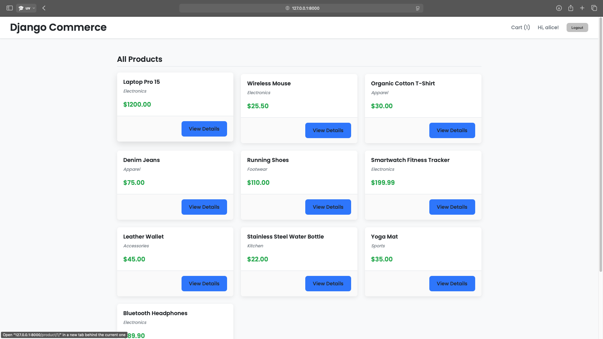
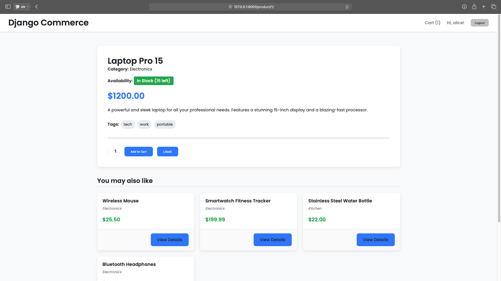
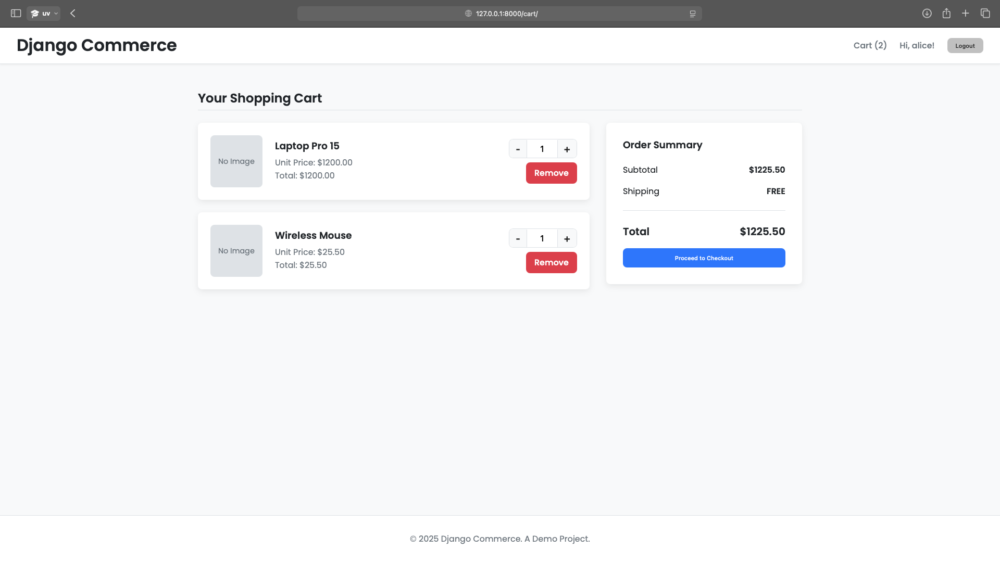
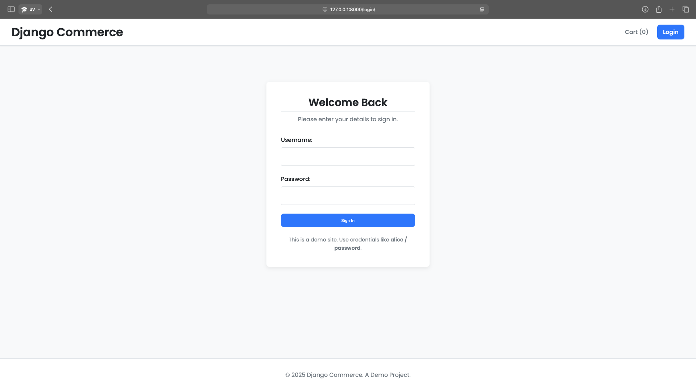
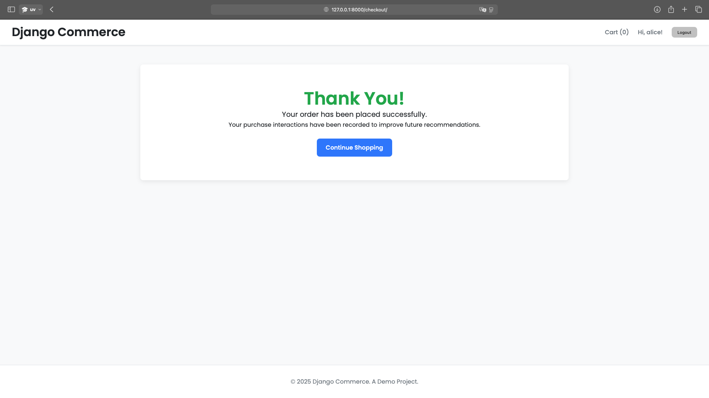

# Django E-commerce Platform with AI-Powered Recommendations

<p align="center">
  
</p>

<div align="center">

[](https://www.python.org/)
[](https://www.djangoproject.com/)
[](https://cython.org/)
[](https://opensource.org/licenses/MIT)
[](https://github.com/psf/black)

</div>

---

A complete e-commerce web application built with **Django**, featuring a sophisticated AI-powered recommendation system. This project demonstrates a full-stack skill set, including a robust backend, a dynamic UI, and performance optimization with **Cython**. The recommendation engine intelligently suggests products based on both product attributes and real-time user behavior.

## ✨ Core Features

### 🛒 E-commerce Functionality
- **Product Catalog:** Clean and modern product listing and detail pages.
- **Dynamic Shopping Cart:** AJAX-powered cart with real-time quantity updates, add/remove functionality.
- **User Authentication:** Secure login, logout, and session management.
- **Mock Checkout:** A simulated checkout process that records user purchase history to feed the recommendation AI.
- **Image Handling:** Products feature image uploads, managed through the Django Admin.

### 🤖 AI-Powered Recommendation System
- **Content-Based Filtering:** The core recommendation logic is an algorithmic machine learning model that represents products as numerical vectors based on their attributes (tags).
- **"You May Also Like":** On each product detail page, a **Cosine Similarity** algorithm identifies and displays other products with the most similar attributes.
- **"Recommended for You":** For logged-in users, the system provides a personalized experience. It creates a "user preference vector" by aggregating the features of products they have previously liked or purchased. It then recommends new items that best match this unique profile, excluding items they've already interacted with.
- **Real-time Feedback Loop:** User actions, such as "liking" a product (via an AJAX call) or "purchasing" items, instantly update their preference profile, leading to new and improved recommendations on their next visit.

### 🚀 Cython Performance Optimization
- **Identified Bottleneck:** The Cosine Similarity calculation, which can be computationally expensive on large datasets, was identified as a key area for optimization.
- **C-Level Speed:** This critical algorithm was re-implemented in Cython (`cy_similarity.pyx`), using static typing and compiler directives to achieve speeds significantly faster than pure Python.
- **Graceful Fallback:** The application is robust. It first tries to import the compiled Cython module. If the module has not been built, it seamlessly falls back to a pure Python/NumPy implementation (`py_similarity.py`), ensuring the project runs in any environment.

## 🛠️ Technology Stack

- **Backend:** Django 5, Python 3.10+
- **Database:** SQLite (for development)
- **AI / Data Science:**
    - **NumPy & Pandas:** For efficient data manipulation and building the product-attribute matrix.
    - **Content-Based Filtering:** The core recommendation algorithm.
- **Performance:** Cython 3.0 for C-level optimization of the similarity calculations.
- **Frontend:**
    - Plain HTML5 & CSS3 with a modern, responsive design (Flexbox, Grid).
    - Vanilla JavaScript for dynamic, AJAX-powered features (e.g., real-time cart updates, product likes).

## 🚀 Getting Started

Follow these instructions to get the project up and running on your local machine.

### 1. Prerequisites

- Python 3.10 or higher
- `pip` and `venv`

### 2. Clone the Repository

```bash
git clone https://github.com/your-username/ecommerce-project.git
cd ecommerce-project
3. Set Up a Virtual Environment
code
Bash
# Create and activate the virtual environment
python3 -m venv venv
source venv/bin/activate

# On Windows, use:
# venv\Scripts\activate```

### 4. Install Dependencies

Install all required packages from `requirements.txt`.

```bash
pip install -r requirements.txt
5. Compile the Cython Module (Recommended for Performance)
To enable the high-performance recommendation engine, build the Cython extension.

code
Bash
python setup.py build_ext --inplace
If you skip this step, the application will automatically use the slower Python fallback.

6. Set Up the Database
Run the standard Django migrations to create the database schema.

code
Bash
python manage.py migrate
7. Create a Superuser
This account is needed to access the Django Admin to manage products and images.

code
Bash
python manage.py createsuperuser
Follow the prompts to set a username and password.

8. Load the Demo Data
A management command is provided to populate the database with sample products, users, and interaction data.

code
Bash
python manage.py load_demo_data
Demo User Credentials:
The loader creates several users. You can log in with:

Username: alice
Password: password
9. Run the Development Server
You are now ready to launch the application!

code
Bash
python manage.py runserver
The e-commerce site will be available at http://127.0.0.1:8000/.
The Django Admin panel will be at http://127.0.0.1:8000/admin/.

🖼️ Project Showcase
Product Detail Page	Dynamic Shopping Cart
	
Modern Login Page	Checkout Confirmation
	
📜 License
This project is licensed under the MIT License - see the LICENSE.md file for details.